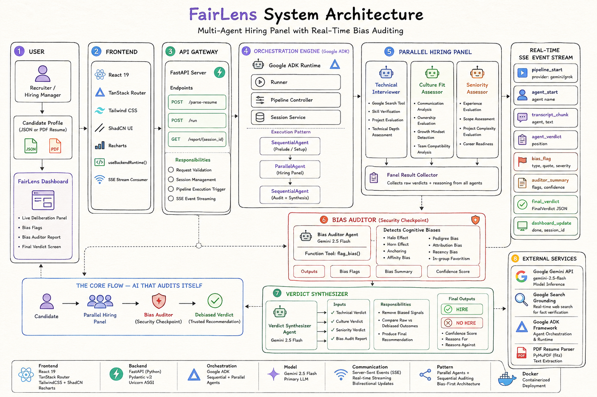
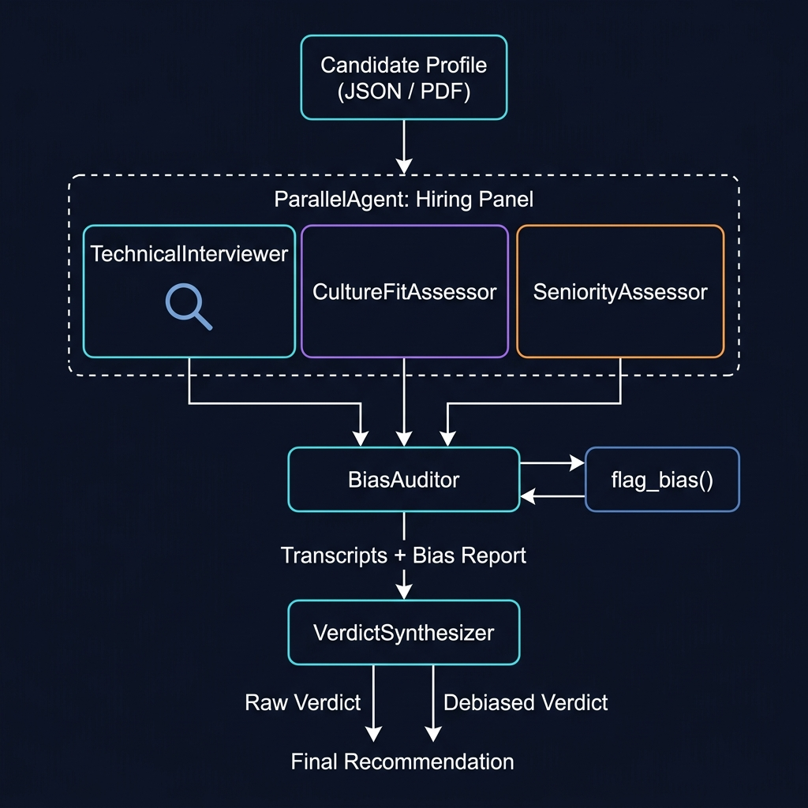

# FairLens — Multi-Agent Hiring Panel with Real-Time Bias Auditing

> **AI that checks its own blind spots.**

FairLens is a multi-agent AI system that simulates a hiring panel and audits the panel's own reasoning for cognitive bias in real time. Three expert agents evaluate a candidate simultaneously. A fourth agent watches their reasoning and flags bias the moment it appears — inline, mid-sentence, before any verdict is reached. A fifth agent synthesizes a final debiased recommendation.

The gap between the raw panel verdict and the debiased verdict is the product.

Built for **5 Days of Gen AI — Google × Kaggle** using **Google ADK** and **Gemini 2.5 Flash**.

---

## System Architecture



---

## How It Works



---

## Key Features

- **Parallel hiring panel** — Three LlmAgents run concurrently via ADK `ParallelAgent`. Each agent forms an independent opinion with no shared context, making bias detection meaningful.

- **Real-time bias auditing** — A dedicated `BiasAuditor` agent monitors all three transcripts and calls `flag_bias()` for every instance of cognitive bias detected. Eight bias types are flagged with severity ratings (LOW / MEDIUM / HIGH) and corrective reframes.

- **Debiased verdict synthesis** — The `VerdictSynthesizer` receives both the panel transcripts and the bias report, removes flagged reasoning, and produces two verdicts side by side: what the panel said, and what the evidence says.

- **Live SSE streaming** — Every token, every flag, every verdict streams from FastAPI to the React frontend in real time via Server-Sent Events. The bias flag card appears inline in the agent's transcript mid-sentence.

- **Google Search grounding** — The Technical Interviewer uses ADK's built-in `google_search` tool autonomously. When a candidate claims a specific tech stack or project, the agent decides on its own to verify the claim against live web results.

- **Triple provider fallback** — Gemini 2.5 Flash is primary. If it hits a rate limit or fails, the pipeline automatically falls back to Grok (`grok-2-1212`), then Groq (`llama-3.3-70b-versatile`). The frontend never sees an error — just a different provider chip.

- **PDF resume parsing** — Upload a resume PDF. PyMuPDF extracts the text server-side. Gemini structures it into the candidate JSON format. The user reviews and edits before running the panel.

---

## Bias Types Detected

| Bias Type             | Description                                                   |
| --------------------- | ------------------------------------------------------------- |
| `pedigree_bias`       | Over-weighting school or company brand as a proxy for ability |
| `halo_effect`         | One strong signal inflating evaluation of unrelated areas     |
| `horn_effect`         | One weak signal deflating evaluation of unrelated strengths   |
| `anchoring`           | First signal dominating all subsequent reasoning              |
| `affinity_bias`       | Favoring candidates who feel personally familiar              |
| `attribution_bias`    | Same behavior judged differently based on perceived group     |
| `recency_bias`        | Last signal mentioned dominating the overall verdict          |
| `in_group_favoritism` | Belonging cues weighted over job-relevant evidence            |

Each flag includes: the exact quoted phrase, which agent said it, severity level, explanation, and a corrective reframe.

---

## ADK Pipeline Structure

```python
# Full pipeline — pipeline.py
full_pipeline = SequentialAgent(
    name="BiasAuditorPanel",
    sub_agents=[panel, post_panel]
)

# Step 1 — all three run concurrently
panel = ParallelAgent(
    name="HiringPanel",
    sub_agents=[
        technical_interviewer,   # LlmAgent + google_search
        culture_assessor,        # LlmAgent
        seniority_assessor,      # LlmAgent
    ]
)

# Step 2 — strict order: audit before synthesize
post_panel = SequentialAgent(
    name="AuditAndSynthesize",
    sub_agents=[
        bias_auditor,            # LlmAgent + FunctionTool(flag_bias) + BuiltInPlanner
        verdict_synthesizer,     # LlmAgent + output_schema + BuiltInPlanner
    ]
)
```

### Agent Reference

| Agent                  | File                    | Tools                     | Output Key             | Planner                       |
| ---------------------- | ----------------------- | ------------------------- | ---------------------- | ----------------------------- |
| `TechnicalInterviewer` | `agents/technical.py`   | `google_search`           | `technical_transcript` | —                             |
| `CultureFitAssessor`   | `agents/culture.py`     | —                         | `culture_transcript`   | —                             |
| `SeniorityAssessor`    | `agents/seniority.py`   | —                         | `seniority_transcript` | —                             |
| `BiasAuditor`          | `agents/auditor.py`     | `FunctionTool(flag_bias)` | `bias_report`          | `BuiltInPlanner(budget=8192)` |
| `VerdictSynthesizer`   | `agents/synthesizer.py` | —                         | `final_verdict`        | `BuiltInPlanner(budget=8192)` |

---

## SSE Event Stream

All events are emitted by `run_pipeline()` via `asyncio.Queue` and consumed by `useBackendRuntime()` on the frontend.

| Event              | Payload                                                                       | UI Effect                                  |
| ------------------ | ----------------------------------------------------------------------------- | ------------------------------------------ |
| `pipeline_start`   | `{ provider }`                                                                | Provider chip shown, timer starts          |
| `agent_start`      | `{ agent }`                                                                   | Sidebar dot pulses, column cursor blinks   |
| `transcript_chunk` | `{ agent, text }`                                                             | Text appends character by character        |
| `agent_verdict`    | `{ agent, position, justification }`                                          | Verdict badge appears in column footer     |
| `bias_flag`        | `{ agent_name, bias_type, quote, severity, explanation, corrective_reframe }` | Red flag card slides in mid-transcript     |
| `auditor_summary`  | `{ total_flags, confidence_score, most_biased_agent, ... }`                   | Confidence ring draws, report tab unlocks  |
| `final_verdict`    | `{ raw_verdict, debiased_verdict, final_recommendation, ... }`                | Verdict flip rendered, verdict tab unlocks |
| `agent_done`       | `{ agent }`                                                                   | Sidebar dot turns green                    |
| `done`             | `{ session_id }`                                                              | All agents confirmed complete              |

---

## Tech Stack

### Frontend

| Technology      | Version  | Purpose                          |
| --------------- | -------- | -------------------------------- |
| React           | 19       | UI framework                     |
| TanStack Start  | latest   | Meta-framework (Vite + Nitro)    |
| TanStack Router | latest   | File-based routing               |
| Tailwind CSS    | v4       | Styling with OKLCH design tokens |
| shadcn/ui       | New York | Radix-based UI primitives        |
| Recharts        | latest   | Bias breakdown charts            |
| Lucide React    | latest   | Icons                            |
| Bun             | latest   | Package manager and runtime      |

### Backend

| Technology          | Version | Purpose                      |
| ------------------- | ------- | ---------------------------- |
| Python              | 3.9+    | Runtime                      |
| FastAPI             | 0.115+  | REST API + SSE streaming     |
| Uvicorn             | 0.34+   | ASGI server                  |
| Pydantic            | v2      | Schema validation            |
| Google ADK          | latest  | Agent orchestration          |
| google-generativeai | latest  | Gemini 2.5 Flash access      |
| PyMuPDF (fitz)      | 1.24+   | PDF text extraction          |
| sse-starlette       | latest  | Server-Sent Events           |
| OpenAI Python SDK   | 1.0+    | Grok and Groq fallback       |
| python-dotenv       | latest  | Environment variable loading |

---

## Project Structure

```
Fairlens/
├── docs/
│   ├── system_architecture.jpg     # Architecture diagram
│   ├── backend-architecture.md     # Detailed backend documentation
│   └── ui-architecture.md          # UI design system documentation
│
├── fairlens_backend/               # Python FastAPI backend
│   ├── main.py                     # FastAPI entry point, routes, CORS, session management
│   ├── pipeline.py                 # Google ADK pipeline orchestrator
│   ├── grok_pipeline.py            # Grok/xAI fallback pipeline
│   ├── groq_pipeline.py            # Groq fallback pipeline
│   ├── agents/
│   │   ├── technical.py            # TechnicalInterviewer — LlmAgent + google_search
│   │   ├── culture.py              # CultureFitAssessor — LlmAgent
│   │   ├── seniority.py            # SeniorityAssessor — LlmAgent
│   │   ├── auditor.py              # BiasAuditor — LlmAgent + FunctionTool + BuiltInPlanner
│   │   └── synthesizer.py          # VerdictSynthesizer — LlmAgent + output_schema
│   ├── models/
│   │   ├── schemas.py              # Pydantic models (RunRequest, FinalVerdict, BiasFlag...)
│   │   └── provider.py             # Provider resolution (Gemini → Grok → Groq)
│   ├── prompts/
│   │   └── system_prompts.py       # System prompts for all five agents
│   ├── tools/
│   │   └── flag_bias.py            # flag_bias() FunctionTool + in-memory session store
│   └── requirements.txt
│
├── src/                            # React 19 frontend
│   ├── routes/
│   │   └── index.tsx               # Root route, stage machine (input → panel → report)
│   ├── components/
│   │   ├── InputScreen.tsx         # Candidate profile input + PDF upload
│   │   ├── LivePanel.tsx           # Three-column streaming transcript view
│   │   ├── ReportScreen.tsx        # Auditor report + final verdict
│   │   ├── Sidebar.tsx             # Pipeline status sidebar
│   │   └── primitives.tsx          # Chip, InlineFlag, VerdictBadge, ConfidenceRing
│   ├── lib/
│   │   ├── use-backend-runtime.ts  # SSE consumer hook (real backend)
│   │   └── use-scenario-runtime.ts # Mock streaming fallback
│   └── styles.css                  # OKLCH design tokens and animations
│
├── package.json
├── tsconfig.json
├── vite.config.ts
└── README.md
```

---

## Setup and Installation

### Prerequisites

- Python 3.9+ (or Docker / Docker Compose)
- Bun (or Node.js 18+)
- Google AI Studio API key — [aistudio.google.com](https://aistudio.google.com)
- Optional: xAI API key for Grok fallback
- Optional: Groq API key for Groq fallback

---

### Option A: Docker Compose (Production-Grade & Recommended)

This builds and orchestrates both the Python FastAPI backend and the Bun React frontend with optimal container boundaries.

1. **Clone the repository**:

   ```bash
   git clone https://github.com/your-username/fairlens.git
   cd fairlens
   ```

2. **Configure environment variables**:
   Create `fairlens_backend/.env` (using `.env.example` as a template):

   ```bash
   cp .env.example fairlens_backend/.env
   ```

   Open `fairlens_backend/.env` and enter your API keys.

3. **Launch the services**:

   ```bash
   docker compose up --build -d
   ```

   This will spin up the backend (port 8000) with automatic health-checking and the frontend (port 5173).

4. **Verify Health**:
   ```bash
   curl http://localhost:8000/health
   # Returns: { "status": "ok" }
   ```

---

### Option B: Local Virtual Environment Setup (Development)

1. **Clone the repository**:

   ```bash
   git clone https://github.com/your-username/fairlens.git
   cd fairlens
   ```

2. **Backend environment**:
   Create `fairlens_backend/.env`:

   ```env
   GOOGLE_API_KEY=your_google_api_key_here
   GOOGLE_GENAI_USE_VERTEXAI=FALSE

   # Optional fallbacks
   XAI_API_KEY=your_xai_api_key_here
   GROQ_API_KEY=your_groq_api_key_here
   ```

3. **Backend setup**:

   ```bash
   cd fairlens_backend

   # Create and activate virtual environment
   python -m venv ../.venv

   # Windows
   ..\.venv\Scripts\Activate.ps1

   # macOS / Linux
   source ../.venv/bin/activate

   # Install dependencies
   pip install -r requirements.txt

   # Verify installation
   python -c "import google.adk; print('ADK ready')"
   python -c "import fitz; print('PyMuPDF ready')"

   # Start the backend server
   uvicorn main:app --reload --port 8000
   ```

   Backend runs at `http://localhost:8000`

4. **Frontend setup**:
   Open a new terminal in the project root:

   ```bash
   # Install dependencies
   bun install

   # Start the development server
   bun run dev
   ```

   Frontend runs at `http://localhost:5173`

---

## Production Security & Limits

The application includes built-in security features to protect API integrity and prevent resource exhaustion:

- **UUID v4 format validation** on `session_id`: Any `POST /run` with a non-UUID v4 format is rejected (`400 Bad Request`).
- **Candidate profile size limit**: Candidate profiles exceeding 50KB are rejected (`413 Payload Too Large`).
- **Concurrent session limit**: Up to 10 concurrent pipeline runs are allowed. Excess sessions receive `503 Service Unavailable`.
- **CORS restrictions**: Access is restricted strictly to local dev origins in development.
- **Data persistence**: Ephemeral, in-memory state storage. No candidate data or transcripts are stored in databases.

---

## API Reference

### `GET /health`

Health check.

```json
{ "status": "ok" }
```

---

### `POST /parse-resume`

Upload a PDF resume. Returns a structured candidate JSON profile.

**Request:** `multipart/form-data` with `file: UploadFile`

**Response:**

```json
{
  "candidate": {
    "name": "Alex Kim",
    "target_role": "",
    "target_level": "L3 / L4 / L5 / L6",
    "years_experience": 6,
    "education": "Coding bootcamp",
    "current_company": "Series A healthcare startup",
    "current_title": "Software Engineer",
    "past_companies": ["Agency X", "Freelance"],
    "key_projects": ["..."],
    "interview_notes": "",
    "interviewer_raw_notes": []
  },
  "raw_text_preview": "First 500 characters of extracted text..."
}
```

**Errors:**

- `400` — File is not a PDF
- `422` — No text could be extracted (scanned image PDF)
- `502` — All LLM providers failed

---

### `POST /run`

Start the multi-agent pipeline. Returns an SSE stream.

**Request:**

```json
{
  "session_id": "uuid-string",
  "candidate": { "name": "...", "key_projects": ["..."], "...": "..." },
  "target_level": "L3 | L4 | L5 | L6",
  "panel_mode": "Balanced | Technical-heavy | Culture-heavy"
}
```

**Response:** `text/event-stream`

See [SSE Event Stream](#sse-event-stream) for full event catalogue.

**Errors:**

- `409` — Session already running

---

### `GET /report/{session_id}`

Retrieve the final verdict for a completed session.

**Response:** `FinalVerdict` JSON object

**Errors:**

- `425` — Pipeline still running
- `404` — Session not found

---

## Confidence Score

The confidence score (0–100) reflects how bias-contaminated the panel's reasoning was.

```
deduction = (HIGH flags × 15) + (MEDIUM flags × 7) + (LOW flags × 3)

If verdict did NOT change after debiasing:
    deduction = deduction × 0.5   ← penalty halved, verdict held up

confidence_score = max(20, 100 - deduction)
```

A score of 100 means zero bias detected. A score of 20 means the majority of panel reasoning was flagged. When the raw and debiased verdicts differ, that difference is the evidence that bias was affecting the decision.

---

## Provider Fallback Chain

```
resolve_provider()
      │
      ├── GOOGLE_API_KEY valid? ──► Gemini 2.5 Flash (Google ADK)
      │                             Full ParallelAgent pipeline
      │                             Google Search grounding
      │
      ├── ADK exception at runtime?
      │         │
      │         ├── XAI_API_KEY valid? ──► Grok grok-2-1212
      │         │                          Sequential fallback pipeline
      │         │
      │         └── GROQ_API_KEY valid? ──► Groq llama-3.3-70b-versatile
      │                                     Sequential fallback pipeline
      │
      └── None available ──► error SSE event
```

---

## Disclaimer

FairLens is a reflection and discussion tool. Bias flags are surfaced to prompt review and reconsideration — they are not definitive verdicts. Final hiring decisions remain with humans. FairLens does not store candidate data between sessions. All session state is held in memory and cleared on server restart.

---

## Built With

- [Google Agent Development Kit](https://google.github.io/adk-docs/)
- [Gemini 2.5 Flash](https://deepmind.google/technologies/gemini/)
- [FastAPI](https://fastapi.tiangolo.com/)
- [React 19](https://react.dev/)
- [TanStack](https://tanstack.com/)

---

_5 Days of Gen AI — Google × Kaggle Capstone Project_
